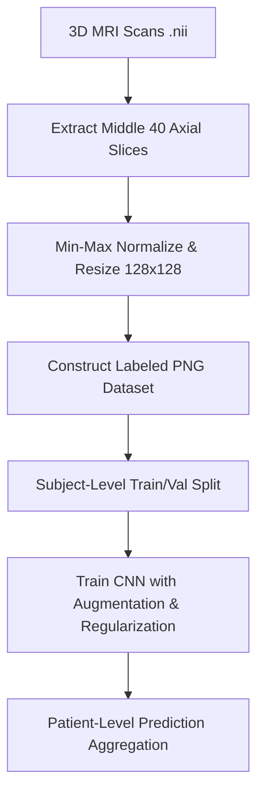

# Autism Spectrum Disorder (ASD) Detection using Brain MRI & CNN


A deep learning pipeline for the early screening and classification of Autism Spectrum Disorder (ASD) using structural brain Magnetic Resonance Imaging (MRI) scans. Raw 3D medical imaging data in NIfTI (`.nii`) format is preprocessed into 2D axial slice images, and a Convolutional Neural Network (CNN) is trained to differentiate between autistic and non-autistic subjects.

> [!IMPORTANT]
> **Clinical Disclaimer**: This project is designed as an educational and decision-support research tool, not a clinical diagnostic replacement. Clinical diagnosis of Autism Spectrum Disorder must rely on comprehensive professional behavioral and neurological assessments.

---

## 📌 Project Overview

Traditional ASD diagnosis relies heavily on behavioral evaluation, which can delay early intervention. This project explores computer-aided diagnosis using 3D structural brain MRI scans. By extracting informative middle axial slices and training a deep CNN with data augmentation and subject-level data splitting, the model learns structural patterns associated with ASD while minimizing data leakage.

---

## 🛠️ Pipeline Workflow



1. **Load 3D Brain Scans**: Read NIfTI (`.nii`) files using `NiBabel`.
2. **Slice Extraction**: Extract the middle 40 axial slices where key brain structural features are present.
3. **Preprocessing**: Min-max normalize pixel intensities to `[0, 255]` and resize to $128 \times 128$ resolution.
4. **Dataset Construction**: Save preprocessed slices as PNG images in `processed_dataset/`.
5. **Subject-Aware Splitting**: Perform train/validation splits by subject ID to avoid data leakage between slices of the same scan.
6. **CNN Classification & Aggregation**: Train a 2D CNN with data augmentation and average slice predictions across a subject's scan to produce patient-level output.

---

## 📁 Repository Structure

```
autism-mri-cnn/
├── autistic/               # Folder for raw .nii scans of autistic subjects
├── non-autistic/           # Folder for raw .nii scans of non-autistic subjects
├── processed_dataset/      # Generated 2D slice PNG images
│   ├── autistic/
│   └── non_autistic/
├── create_dataset.py       # Preprocesses 3D .nii files into 2D PNG slice dataset
├── train_cnn.py            # CNN model training script (subject-level split & augmentation)
├── predict.py              # Patient-level inference script on a single .nii scan
├── main.py                 # Quick visualization script for brain MRI slices
├── requirements.txt        # Python package dependencies
├── .gitignore              # Files ignored by Git
└── README.md               # Project documentation
```

---

## 🧰 Technologies Used

- **Python 3.8+**
- **TensorFlow / Keras**: CNN architecture, data pipelines (`tf.data`), and data augmentation
- **NiBabel**: Reading and processing 3D medical NIfTI imaging format
- **OpenCV (`cv2`) & NumPy**: Image resizing, normalization, and matrix operations
- **Matplotlib**: Visualizing brain MRI slices
- **Scikit-learn**: Data handling and validation utilities

---

## 🧠 Model Architecture & Strategy

The classifier uses a custom Convolutional Neural Network featuring:
- **Data Augmentation**: Random horizontal flips, rotations, zooms, translations, and contrast adjustments.
- **Feature Extraction**: 3 Convolution-BatchNorm-ReLU-MaxPool blocks with increasing filter sizes (32, 64, 96) and progressive dropout (0.2–0.4).
- **Global Pooling & Regularization**: `GlobalAveragePooling2D` followed by a Dense layer with $L_2$ regularization ($2 \times 10^{-4}$) and 50% Dropout.
- **Subject-Level Split**: Ensures images from the same subject never appear in both training and validation sets simultaneously.

---

## 🚀 Getting Started

### 1. Prerequisites & Installation

Clone the repository and install the required dependencies:

```bash
# Clone repository
git clone https://github.com/tanvichitturu/autism-mri-cnn.git
cd autism-mri-cnn

# Create a virtual environment
python -m venv mri_env

# Activate virtual environment
# Windows (PowerShell):
.\mri_env\Scripts\activate
# Linux / macOS:
source mri_env/bin/activate

# Install dependencies
pip install -r requirements.txt
```

---

### 2. Usage Instructions

#### Step 1: Prepare Raw MRI Data
Place your 3D NIfTI (`.nii`) brain scan files into the respective folders:
- `autistic/`
- `non-autistic/`

#### Step 2: Generate 2D Slice Dataset
Convert 3D MRI scans into normalized 2D PNG slice images:
```bash
python create_dataset.py
```

#### Step 3: Train the CNN Model
Train the neural network with subject-level splitting and callbacks:
```bash
python train_cnn.py
```
This saves the best model checkpoint as `autism_mri_model.h5`.

#### Step 4: Run Patient-Level Prediction
Predict ASD status on a new 3D MRI scan (`sample.nii`):
```bash
python predict.py
```

#### Step 5: Visualize Brain MRI Slices
To quickly display an MRI scan slice with Matplotlib:
```bash
python main.py
```

---

## 📊 Results & Observations

- **Training Accuracy**: ~99%
- **Validation Accuracy**: ~75% – 80% (evaluated via strict subject-level split)
- **Observations**: Subject-level splitting and data augmentation successfully mitigate spatial slice correlation and overfitting common in 2D slice-based medical image processing.

---

## 🔮 Future Improvements

- [ ] **3D CNN Architecture**: Migrate from 2D slice extraction to 3D volumetric convolutions (e.g., 3D ResNet / UNet).
- [ ] **Cross-Site Validation**: Validate model performance across diverse imaging sites using the [ABIDE Dataset](https://fcon_1000.projects.nitrc.org/indi/abide/).
- [ ] **Explainability (XAI)**: Implement Grad-CAM or integrated gradients to visualize brain regions contributing to predictions.
- [ ] **Multimodal Fusion**: Integrate structural MRI with functional MRI (fMRI) or clinical phenotypic metadata.

---

## 📜 License

Distributed under the MIT License. See `LICENSE` for more information.
